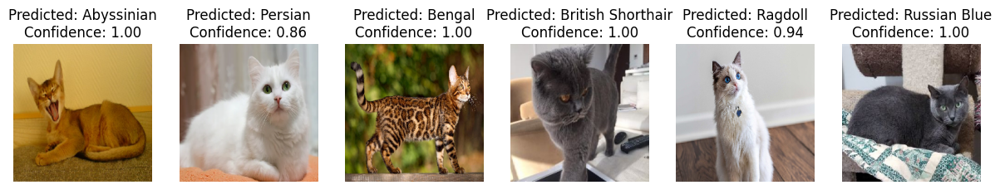

# Cat_Breed_Classification
A machine learning image classification project to detect cat breeds from dicoding machine learning course

## Dataset
* source : [oxford-iit-cats-extended-10k](https://www.kaggle.com/datasets/doctrinek/oxford-iiit-cats-extended-10k)
* about : this dataset contains 12 differents cat breeds
* samples : 10k images in total from 12 subfolders (class), all the images have different image resolution

## Files
- image_predict &rarr; folder of the images used for prediction
- old_code &rarr; folder containing old files 
- predict_result &rarr; result image file of the prediction
- cat_breed_classification_2.ipynb &rarr; notebook file for the project 
- cat_breed_classification_2.py &rarr; python file for the project
- vegs.tflite &rarr; the saved model ready to be deployed to Android

## Criteria
- free dataset with **1000 images minimum**
- dataset **has never been used** in previous machine learning class submissions
- dataset is split into **80% train set** and **20% test set**
- model should use **model sequential**
- model should use **Conv2D Maxpooling layer**
- accuracy on training and validation set is **80% minimum**
- implement **callback**
- create **plot** for model accuracy and loss
- create code to save model in **TFLite** format

## Optional criteria (5*)
- dataset has minimum **10000 images** and **3 class**
- image resolution in dataset is not constant (varies)
- accuracy on training and validation set is **92% minimum**
